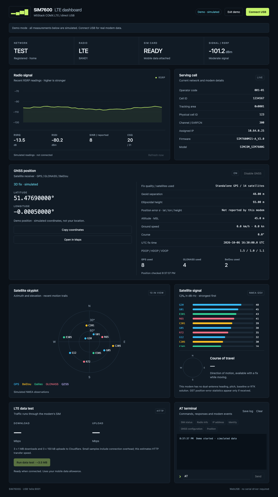

# SIM7600 WebUSB LTE & GNSS Dashboard

[](https://github.com/pgodlews/sim7600-webusb-dashboard/actions/workflows/ci.yml)
[](https://github.com/pgodlews/sim7600-webusb-dashboard/actions/workflows/pages.yml)
[](LICENSE)

**[Open the dashboard](https://pgodlews.github.io/sim7600-webusb-dashboard/)** · **[Try the demo](https://pgodlews.github.io/sim7600-webusb-dashboard/?demo=1)** (no hardware needed)

A standalone browser dashboard for the **M5Stack COMX.LTE / SIM7600G** modem. It connects directly over USB, with no serial driver, backend, package installation or external runtime dependencies.



## Quick start

1. Open **https://pgodlews.github.io/sim7600-webusb-dashboard/** in **Google Chrome or Microsoft Edge**, or download `index.html` and open it locally.
2. Connect the powered modem with a USB data cable. Close other applications using its USB interface.
3. Click **Connect USB** and choose **SimTech, Incorporated** in the browser's device picker.
4. For satellite positioning, connect a suitable GNSS antenna, click **Enable GNSS** if needed, and give the antenna a clear view of the sky.

Click **Try demo**, or open [`?demo=1`](https://pgodlews.github.io/sim7600-webusb-dashboard/?demo=1), to explore simulated LTE and satellite observations without connecting hardware. Demo data is explicitly labelled and is not your location.

If your browser does not allow USB access from a local file, serve the folder on localhost:

```sh
python3 -m http.server 8000
```

Then open `http://localhost:8000` in Chrome or Edge. Hosted copies need HTTPS; the GitHub Pages copy above qualifies. Browser support for WebUSB varies; Safari does not support this connection method.

## Features

### LTE

- SIM readiness, operator, network registration and data attachment.
- LTE band, serving cell, tracking area, physical cell ID, channel and assigned IP.
- RSRP history, RSRQ, RSSI, reported SINR and CSQ readings.
- Firmware and modem identity queries.
- Download/upload tests performed by the modem's HTTP client over its SIM connection.

### GNSS

- Receiver on/off control and 2D/3D fix status.
- Decimal latitude/longitude, altitude above mean sea level, geoid separation and ellipsoidal height.
- Ground speed in km/h and knots, course of travel, UTC fix time and DOP readings.
- Satellites used per constellation when reported by the modem.
- Polar satellite skyplot with bounded motion trails and per-satellite C/N₀ bars.
- GPS, GLONASS, BeiDou, Galileo, QZSS and SBAS labels when present in the NMEA stream.
- Coordinate copying and an explicit **Open in Maps** action.

### Text messages and USSD

- **Load messages** reads existing texts from the SIM card or modem memory. Sender/recipient, timestamp, status and text are shown. Reading received texts marks them as read.
- New-message alerts update the badge. Loaded messages refresh after an incoming notification when the automatic-refresh checkbox is enabled; the other storage remains selectable.
- **Send text** submits one SMS to a phone number or short code. Use an international number such as `+44…` where possible. Sending can incur charges, including roaming charges. Network acceptance does not prove delivery.
- Standard GSM characters allow up to 160 encoded characters; extended symbols count twice. Other basic Unicode characters, including Polish letters, allow up to 70 characters. Emoji and longer outgoing messages are not supported in this version. Received multipart texts are displayed as separate labelled parts.
- **Delete text** permanently removes one stored message after confirmation. The app checks the SIM identity and re-reads the slot before deleting, preventing deletion from an old list after a card swap or slot reuse. There is no bulk-delete button.
- **USSD** runs an operator code, shows the response, supports numeric menu replies and provides **End session**. Codes can change services or incur charges, so check the intended code with the operator. No automatic carrier codes are run.
- SMS and USSD use the modem directly and do not initiate mobile internet traffic. Carrier support varies, especially for data-only SIMs and roaming.

Messages and USSD responses remain in browser memory. They are cleared when reconnecting or changing demo mode; SIM changes clear cached messages before an action is allowed. The AT log can contain message contents, phone numbers and account details; clear it before swapping cards if you want to remove previous output.

### Terminal and offline use

- AT command terminal, common query buttons and local log export.
- Raw NMEA events alongside command responses.
- Self-contained `index.html`, including styles, JavaScript and favicon.
- Explicit demo mode with simulated observations.

## Limits compared with a UM982

The SIM7600 is a cellular modem with standalone GNSS, not a dual-antenna RTK receiver. It cannot provide the UM982's RTK solution, antenna baseline, stationary true heading, pitch/roll or Unicore antenna diagnostics. The compass shows **direction of motion**, not the orientation of the device.

The standard NMEA reporting mask does not advertise GST position-error statistics. Those fields remain “not reported” unless a valid GST sentence actually arrives. Extra decimal places format the coordinate; they do not imply RTK accuracy. Constellations and satellite observations are displayed only when received, not inferred from capability claims.

Invalid fixes clear the coordinates. Disconnected readings are labelled stale; satellite observations expire after 15 seconds. NMEA checksums are validated, and incomplete multipart GSV cycles are not displayed.

## Data tests and privacy

A full data test uses three 1 MB downloads and three 150001-byte uploads to Cloudflare—about **3.5 MB**, plus protocol overhead. The samples include HTTP connection overhead and estimate transfer speed; they are not a sustained multi-stream speed test. They use the SIM's mobile data allowance.

Ordinary browser traffic still uses the computer's normal connection. Connecting this dashboard does not make the modem a system-wide internet adapter.

Modem measurements, SMS content, USSD responses and live coordinates stay in the browser. Exported logs can contain device identifiers and location, so review them before sharing. **Open in Maps** sends the selected coordinates to Google Maps only when clicked. No location is uploaded to the dashboard's hosting service.

## USB and command handling

The verified device layout is vendor `0x1e0e`, product `0x9001`, AT interface **2**, OUT endpoint **3**, IN endpoint **4**. The page validates the descriptor layout before claiming the interface.

AT commands run sequentially; scheduled polling pauses during data tests, SMS actions and USSD requests. SMS uses PDU mode to separate message text from command responses, with GSM and UCS2 decoding. SMS format and selected read storage are restored after each operation. Incoming-message notification settings are restored on normal disconnect. USSD replies are handled independently from command acknowledgements, including multiline replies. The session disables command echo with `ATE0`, and restores echo with `ATE1` on normal disconnect. NMEA reporting uses `AT+CGPSINFOCFG=1,198143`; the previous reporting configuration is restored on normal disconnect. Uploads use small paced chunks to avoid modem input-buffer problems.

## Development

The editable sources are in `src/`. Do not edit the generated `index.html` directly.

| File | Purpose |
| --- | --- |
| `src/app.js` | USB transport, command queue, LTE/GNSS/NMEA parsing and UI |
| `src/style.css` | Responsive dashboard styles |
| `src/index.template.html` | Page structure and metadata |
| `assemble.cjs` | Creates the self-contained `index.html` |
| `tests/transport.cjs` | Simulated USB and protocol checks |
| `docs/screenshots/` | README screenshots, taken in demo mode |
| `.github/workflows/` | CI tests, and GitHub Pages deployment of `index.html` |
| `AGENTS.md` | Repository guidance for coding agents |

Regenerate the distributable and run checks:

```sh
node assemble.cjs
node --check src/app.js
node tests/transport.cjs src/app.js
```

No npm packages are required. Commit the regenerated `index.html` with source changes. CI runs the same checks on every push and pull request, and fails if the committed `index.html` is out of date. Each push to `main` redeploys it to GitHub Pages.

## Verification

The connected SIM7600G responded to direct USB AT queries, completed HTTP transfers, and streamed NMEA GGA/RMC/VTG/GSA/GNS sentences. It had no satellite fix during those checks.

Simulated-device checks cover endpoint selection, responses, transfer sequences, cleanup, GNSS units and hemisphere conversion, fix loss, NMEA checksum validation, multipart GSV assembly, stale satellite expiry and demo mode. Messaging checks also cover GSM/Unicode encoding, multipart headers, a send prompt without a trailing newline, incoming notifications, USSD menus and Unicode, storage restoration, SIM changes and stale-slot deletion protection. Sending and deletion were tested with a simulated modem; no real texts were sent or deleted. These checks do not replace physical WebUSB permission testing, carrier SMS/USSD support or live satellite reception.

## License

[MIT](LICENSE). Copyright © 2026 **Piotr Godlewski**.
